

  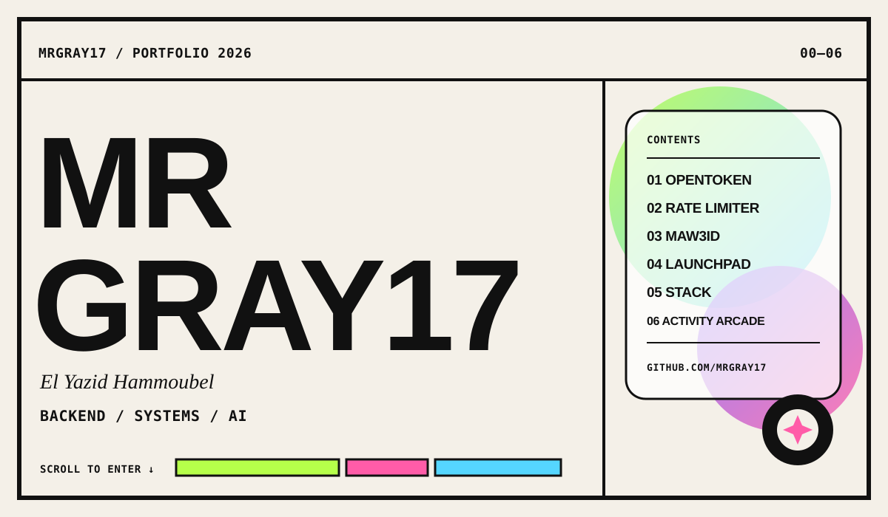

  <a href="https://github.com/MrGray17#work">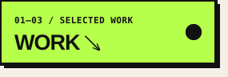</a>
  <a href="https://github.com/MrGray17#stack">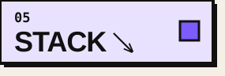</a>
  <a href="https://github.com/MrGray17#arcade">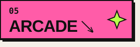</a>
  

  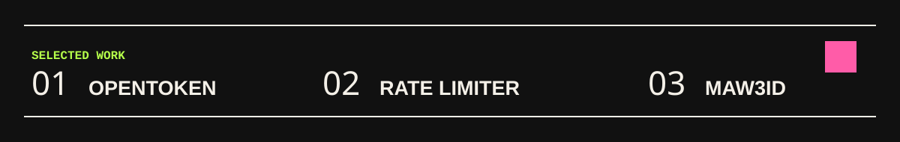

  <a href="https://github.com/MrGray17/opentoken">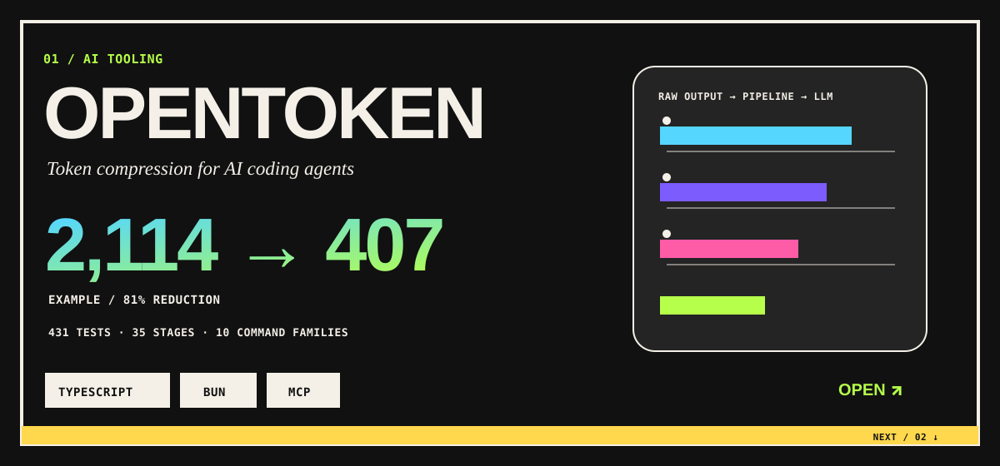</a>

  <a href="https://github.com/MrGray17/rate-limiter">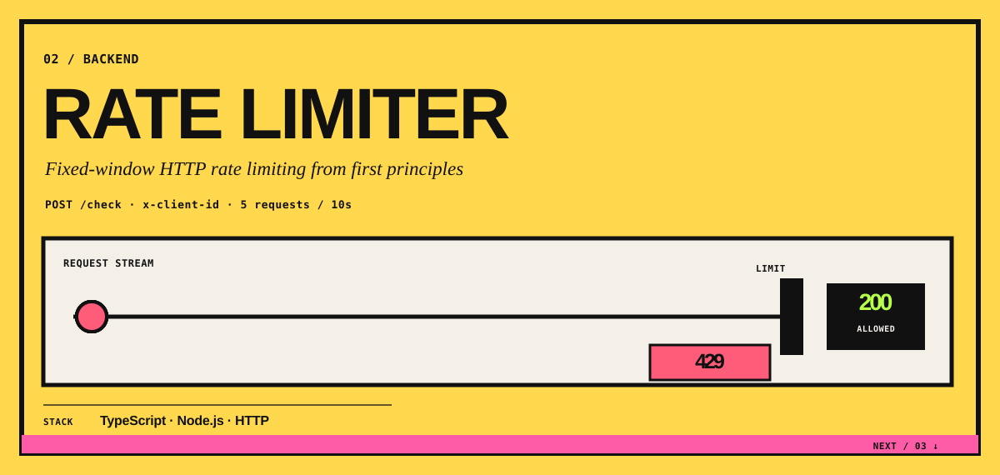</a>

  <a href="https://github.com/MrGray17/Maw3id"></a>

  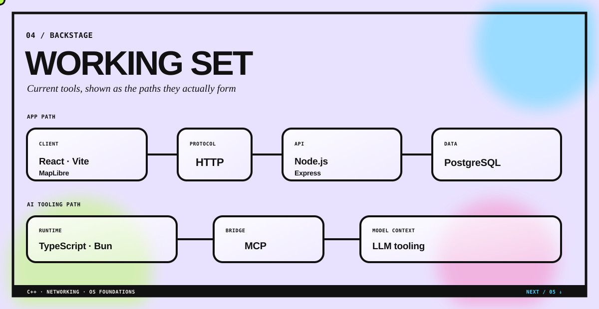

  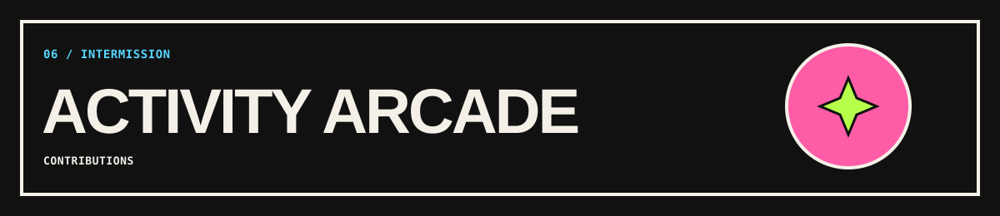

  
  

  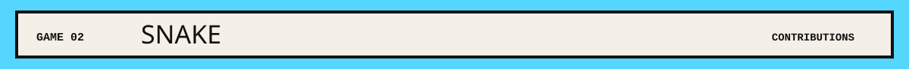
  <picture>
    <source media="(prefers-color-scheme: dark)" srcset="https://raw.githubusercontent.com/MrGray17/MrGray17/output/github-contribution-grid-snake-dark.svg" />
    <source media="(prefers-color-scheme: light)" srcset="https://raw.githubusercontent.com/MrGray17/MrGray17/output/github-contribution-grid-snake.svg" />
    
  </picture>

  <a href="https://github.com/MrGray17?tab=repositories">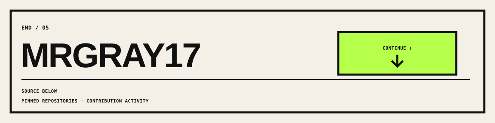</a>

