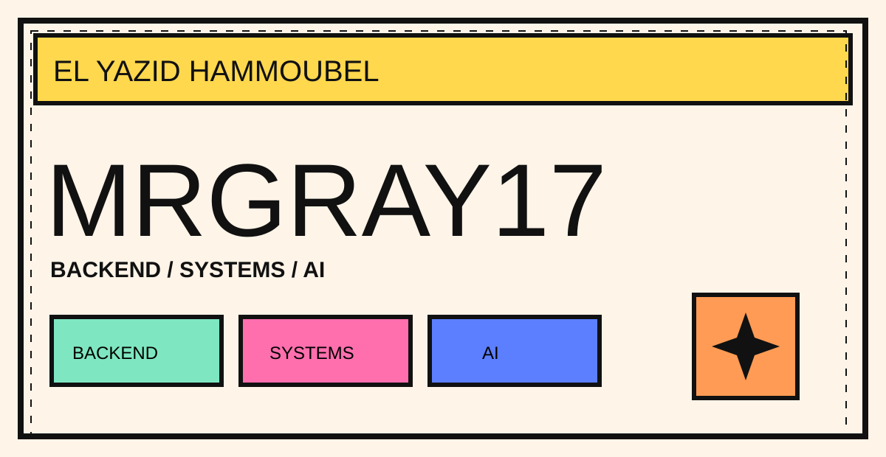
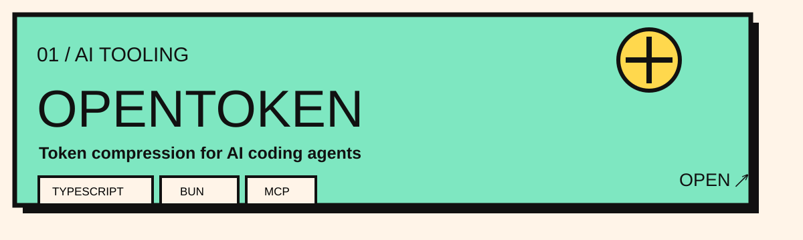
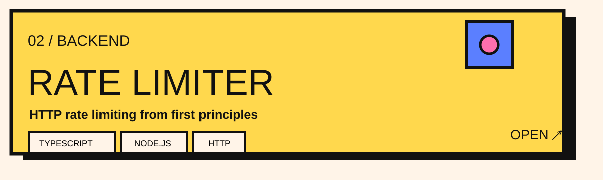
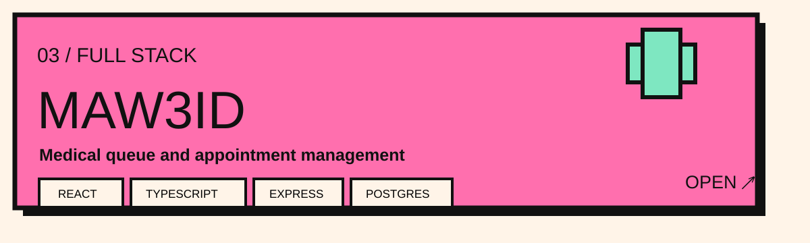
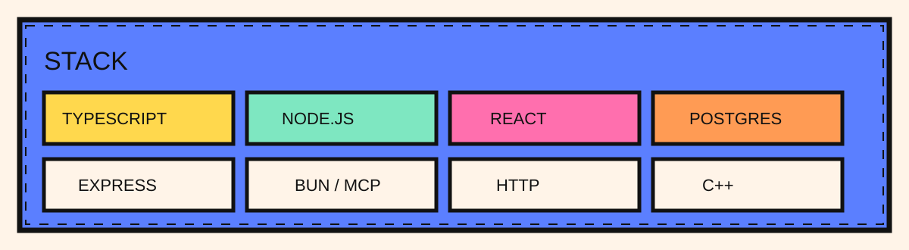
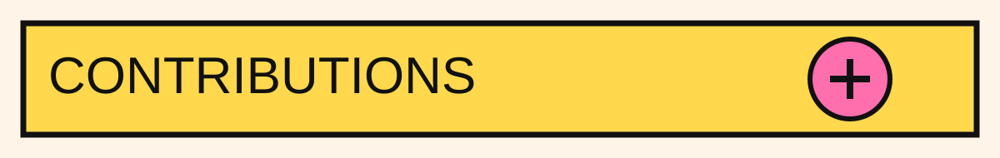
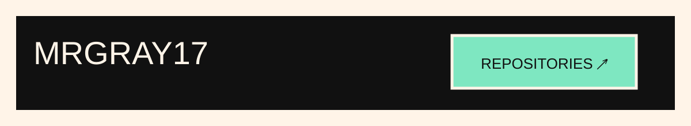

  

  <a href="#projects"><b>PROJECTS</b></a>
  &nbsp;&nbsp;◆&nbsp;&nbsp;
  <a href="#stack"><b>STACK</b></a>
  &nbsp;&nbsp;◆&nbsp;&nbsp;
  <a href="#contributions"><b>CONTRIBUTIONS</b></a>
  &nbsp;&nbsp;◆&nbsp;&nbsp;
  <a href="https://github.com/MrGray17?tab=repositories"><b>ALL REPOS ↗</b></a>

 

  

  

  

 

  

 

  

  

  <picture>
    <source media="(prefers-color-scheme: dark)" srcset="https://raw.githubusercontent.com/MrGray17/MrGray17/output/github-contribution-grid-snake-dark.svg" />
    <source media="(prefers-color-scheme: light)" srcset="https://raw.githubusercontent.com/MrGray17/MrGray17/output/github-contribution-grid-snake.svg" />
    
  </picture>

 

  

