

  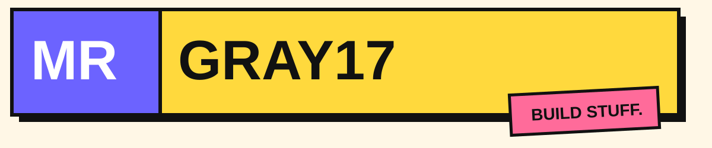

  

  <a href="https://github.com/MrGray17?tab=repositories"><b>repositories</b></a>
  &nbsp;·&nbsp;
  <a href="https://github.com/MrGray17/opentoken"><b>OpenToken</b></a>
  &nbsp;·&nbsp;
  <a href="https://github.com/MrGray17/rate-limiter"><b>Rate Limiter</b></a>
  &nbsp;·&nbsp;
  <a href="https://github.com/MrGray17/Maw3id"><b>Maw3id</b></a>

 

## `01 // engineering telemetry`

  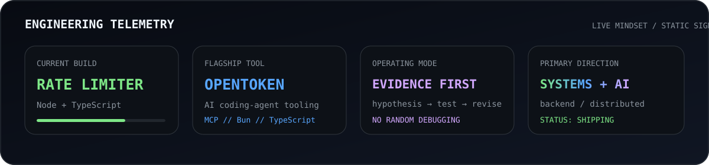

 

## `02 // working stack`

  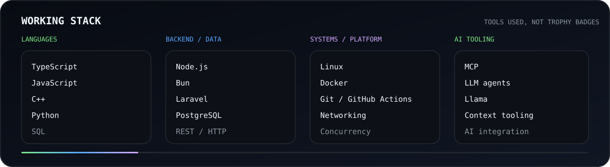

 

## `03 // selected systems`

  <a href="https://github.com/MrGray17/opentoken">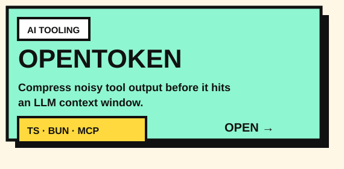</a>
  <a href="https://github.com/MrGray17/rate-limiter">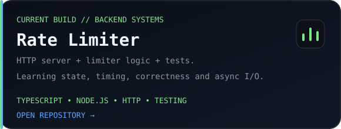</a>

  <a href="https://github.com/MrGray17/Maw3id">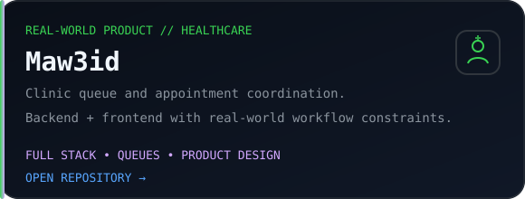</a>
  <a href="https://github.com/MrGray17/jira-ai-agent">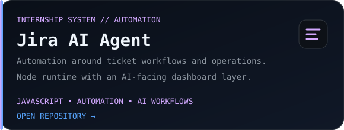</a>

Each panel is a clickable custom SVG — no generic pinned-repo widget.

 

## `04 // contribution arcade`

  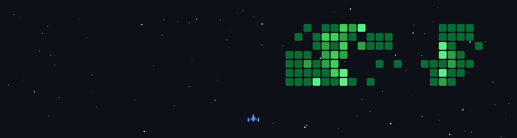

  <picture>
    <source media="(prefers-color-scheme: dark)" srcset="https://raw.githubusercontent.com/MrGray17/MrGray17/output/github-contribution-grid-snake-dark.svg" />
    <source media="(prefers-color-scheme: light)" srcset="https://raw.githubusercontent.com/MrGray17/MrGray17/output/github-contribution-grid-snake.svg" />
    
  </picture>

 

## `05 // strategy replay`

  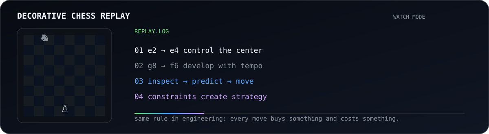

 

## `06 // signal over noise`

  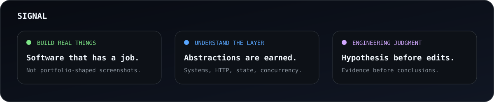

 

## `07 // system scan`

  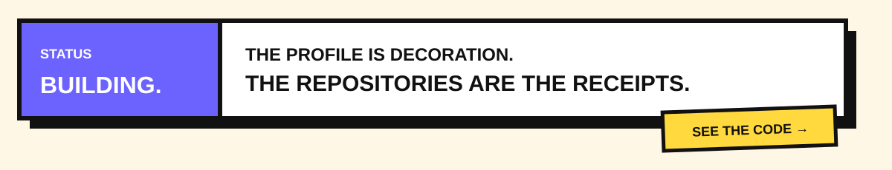

 

  <code>build → break → understand → rebuild</code>
    
  Custom animated SVG system · generated contribution games · no paid README skin dependency.

